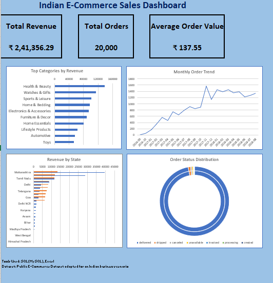

#  Indian E-Commerce Sales Analysis

## Project Overview

This is an end-to-end Data Analytics project that analyzes e-commerce sales performance using SQL and Microsoft Excel. The project focuses on identifying revenue trends, top-performing product categories, regional sales performance, monthly order trends, and order fulfillment metrics through interactive KPI dashboards.

---

## Business Scenario

Assume you are a Data Analyst at a leading Indian e-commerce company similar to Flipkart or Meesho. Management wants to understand:

* Which product categories generate the highest revenue?
* Which states contribute the most sales?
* How do monthly order volumes change over time?
* Which products perform best?
* What is the overall order fulfillment performance?

This project demonstrates how SQL and Excel can be used to answer these business questions and support data-driven decision-making.

---

## Dataset

* **Source:** Public Olist E-Commerce Dataset
* **Business Context:** Adapted into a simulated Indian e-commerce business scenario for portfolio demonstration.
* **Sample Size:** 20,000 Orders

### Tables Used

* Customers
* Orders
* Order Items
* Products

---

## Tools & Technologies

* SQL (MySQL)
* Microsoft Excel
* Pivot Tables
* Charts
* KPI Dashboard

---

## Project Workflow

Dataset
⬇️
MySQL Database
⬇️
SQL Business Analysis
⬇️
Excel Dashboard
⬇️
Business Insights

---

## Dashboard KPIs

* **Total Revenue:** ₹241,356.29
* **Total Orders:** 20,000
* **Average Order Value:** ₹137.55

---

## Dashboard Preview

---

## Business Questions Solved

* Which product categories generate the highest revenue?
* Which states contribute the highest sales?
* What are the monthly sales trends?
* Which products generate the most revenue?
* What is the distribution of order statuses?

---

## Key Insights

* Health & Beauty generated the highest revenue among all product categories.
* Maharashtra recorded the highest overall sales.
* Monthly order volume showed a steady upward trend.
* Delivered orders accounted for the majority of completed transactions.
* Revenue was concentrated among a relatively small number of product categories.

---

## SQL Concepts Used

* Aggregate Functions
* GROUP BY
* ORDER BY
* INNER JOIN
* Common Table Expressions (CTEs)
* Date Functions
* Business KPI Queries

---

## Repository Contents

* SQL Analysis Queries
* Excel Dashboard
* Project Report
* Dashboard Screenshot
* README Documentation

---

## Skills Demonstrated

* SQL
* Business Analysis
* KPI Reporting
* Dashboard Development
* Data Visualization
* Sales Analytics
* Microsoft Excel
* Problem Solving

---

## Future Improvements

* Build an interactive Power BI dashboard.
* Perform Customer Segmentation.
* Implement RFM Analysis.
* Add Cohort Analysis.
* Develop Sales Forecasting models.
