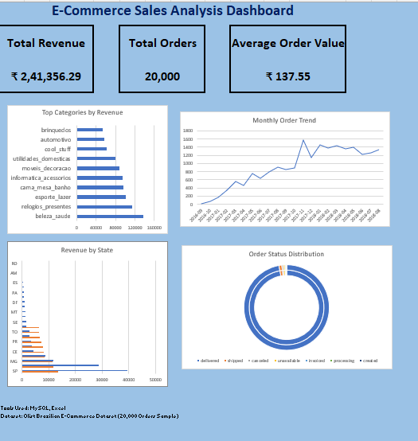

# E-Commerce Sales Analysis using SQL & Excel

## Project Overview

This project analyzes e-commerce sales data using SQL and Excel to identify revenue trends, top-performing products, category performance, regional sales distribution, and order fulfillment effectiveness.

## Tools Used

* MySQL Workbench
* Microsoft Excel
* SQL

## Dataset

* Customers: 20,000
* Orders: 20,000
* Order Items: 20,000
* Products: 19,616

## Key KPIs

* Total Revenue: ₹241,356.29
* Total Orders: 20,000
* Average Order Value: ₹137.55

## Dashboard Preview

## Key Findings

* Beauty & Health was the highest revenue-generating category.
* SP contributed the highest revenue among all regions.
* Monthly order volume showed a generally increasing trend.
* More than 97% of orders were successfully delivered.
* Revenue was concentrated in a limited number of categories and regions.

## Project Files

* SQL Queries
* Excel Dashboard
* Project Report
* Dashboard Screenshot

## Skills Demonstrated

* SQL Joins
* Aggregations
* CTEs
* Subqueries
* Date Functions
* Business Analysis
* Dashboard Creation
* Data Visualization
